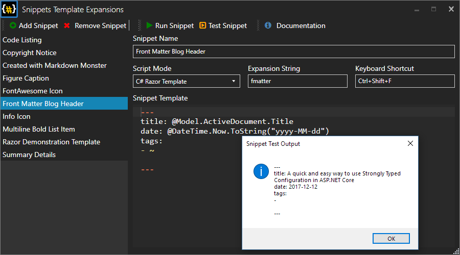

# Markdown Monster Snippets Addin


This project provides a simple snippet manager addin for the Markdown [Monster Markdown Editor and Weblog Publisher](https://markdownmonster.west-wind.com). The addin lets you embed expanded snippets with optional C# expressions or C# Razor code into your Markdown Monster document. 

You can store and select from a list of text based snippets that you can embed into your Markdown or HTML documents by **double clicking**, pressing `ENTER` or `SPACE`.



Snippets make a great use case for:

* Signatures
* Page or Support Templates
* Prefilled Bug Reports
* Timestamping documents


> #### Early pre-release
> This version is a pre-release version so installation and configuration is manual for now. Please see instructions below.


### Dynamic Code Embedding
Snippets support embedding of dynamic code using a couple of expression engines:

* C# Expressions
* C# @Razor Code

In the future we might additional engines like a JavaScript Handlebars engine.

### Embed C# Code Expressions
Snippets can contain embedded C# code expressions using `{{ expression }}` syntax which is evaluated when the snippet is rendered.

For example the following:

```html
<div class="small">
   created by, Rick Strahl, on 
   {{DateTime.Now.ToString("MMM dd, yyyy")}}
</div>   
```

embeds a date into the snippet when it's created. Snippets can embed **any** text since Markdown supports both plain text as well as HTML markup as in the example above.

#### Access to the Addin Model
You also get access to the full Addin model that exposes a large chunk of Markdown Monsters active document, editor and UI using a `Model` property.

For example:

```html
Full Filename: {{Model.ActiveDocument.Filename}}
```

Shows the currently open document's filename.

For more info on what's available check out the documentation or take a look at the Markdown Monster source code:

* [Accessing and manipulating the Active Editor Document](http://markdownmonster.west-wind.com/docs/_4nf02q0sz.htm)


Using this option, you only get to apply expressions and no code blocks, but that still gives you a fair bit of functionality you can work with.

### Embed C# Razor Code
If you need more control, you can also use ASP.NET Style Razor syntax for snippets. As with expressions the `Model` is also available in @Razor snippets.

The following template example accesses the Markdown Monster Model data to get data out of the documents.

```html
Main Window Title:  @Model.Window.Title. 

Timestamp: @DateTime.Now.ToString("MMM dd, yyy")

Filename: @Model.ActiveDocument.Filename

Open Documents:
@foreach(var doc in Model.OpenDocuments) {
    <text>* @doc.Filename</text>
}
```

Here's another example that creates a **Front Matter** blog header which deduces the title from the filename

```csharp
@{
    var file = Path.GetFileNameWithoutExtension(
                                 Model.ActiveDocument.Filename);
    file = StringUtils.FromCamelCase(file);
    file = file.Replace("-"," ");
}---
Title: @file
Timestamp: @DateTime.Now.ToString("MMM dd, yyyy HH:mm")
Tags:
-
---
```

Note that this example, relies on pre-loaded namespaces and assembly references. `System.IO` (namespace) and `Westwind.Utilities` (assembly and namespace) which are pre-loaded as part of the Razor Host startup. 

#### Loading Assemblies and Namespaces
Any non-standard assemblies you might want to reference from the GAC or from disk, you have to explicitly add to your templates.  

If you want to explicitly load an assembly and namespace you can do so by using the `@reference` and `@namespace` directives. 

> #### @reference must load out of the Install Folder
> Any references **must be** loaded out of the Markdown Monster install folder. This limitation is deliberate to prevent script highjacking and requiring custom assemblies to be copied into only into a privileged folder on the local machine.

Here's a silly example that demonstrates showing a message as part of a template.

```
@reference System.Windows.Forms.dll
@using System.Windows.Forms
@{
    MessageBox.Show("hello world");
}
<div class="small">created on @DateTime.Now.ToString("d")</div>
```

Note assemblies have to be referenced with the `.dll` extension and have to be loaded out of the Markdown Monster install folder. They cannot have a path associated with it to limit security exposure as you need elevated rights to put a DLL into the installation folder (`Program Files\MarkdownMonster`).

#### Note: Razor Expressions are Html Encoded by Default
Because the engine is the ASP.NET Razor engine strings returned from `@expressions` are by default formatted to Html encoded text. For example:

```html
@{
    var htmlString = "<div class='Header1'>Huuge</div>";
}
@htmlString
```

produces: `&lt;div class='Header1'&gt;>Huuge&lt;/div&gt;`.

If content you are creating shouldn't be HTML encoded you can use `@Html.Raw(expression)`:

```html
@{
    var htmlString = "<div class='Header1'>Huuge</div>";
}
@Html.Raw(htmlString)
```

Since Markdown is HTML aware however, in most cases HTML encoded strings will actually render correctly as Markdown so the use case for `@Html.Raw()` should be fairly minimal


#### Razor @helpers
You can also use Razor helpers in a snippet:

```html
Message is: @HelloWorld("Rick")

@helper HelloWorld(string name) {
    <div>Hello world, @name! Time is: @DateTime.Now.ToString("d")</div>  
}
```

### Cursor Position: ~ marks the Spot
By default the cursor position for an expanded snippet is immediately after the expanded snippet. If you want to place the cursor inside of the snippets text somewhere you can place a `~` character in the place where you want to cursor to end up.

```markdown
---
Title: 
Timestamp: @DateTime.Now.ToString("MMM dd, yyyy HH:mm")
Tags:
- ~
---
```

Here the cursor will end up at the first tag item to be entered (at the `-`).

### Expansion Keys
You can also create a *shortcut* extension key combination. When you type the key sequence and wait for the type timeout (around 800ms) the snippet is expanded in place to allow for keyboard based extension.

For example, in the screen shot the **fmatter** combination is set up for the script. So if I type **fmatter** in the editor and wait for a second the associated snippet is expanded. Note that the shortcut text to be expanded has to be at the end of the current line - text in the middle of a line is not expanded.


## Open for Feedback
Currently this addin is still under development and we're open to ideas how to expand functionality. There are a number of things that can be done with this but I'm curious how people might want to use this:

#### Scripting Engine
Currently the templates use a simple **{{ Handlebar-like }}** expression syntax that can be embedded into a document. Another option might be to embed a full fledged **Razor Engine** using ASP.NET Style razor syntax to allow much more elaborate scripting.

The latter offers some pretty significant opportunities for generating mail merge like capabilities into Markdown Monster, so I'm leaning towards that. It might also be possible to support both styles since the expression engine is very small and light weight.

#### Code expansion
Adding support for code expansion in the editor so that if you type a letter combination the snippet will fire if the snippet window is open (and perhaps even when not). 

#### Feedback: Use Issues
If you have any thoughts or ideas on this please chime in in the [Issues section](https://github.com/RickStrahl/Snippets-MarkdownMonster-Addin/issues).


### How it works

## Configuration

### Related Links

* [Markdown Monster](https://markdownmonster.west-wind.com)
* [Creating a Markdown Monster Addin](https://markdownmonster.west-wind.com/docs/_4ne0s0qoi.htm)
