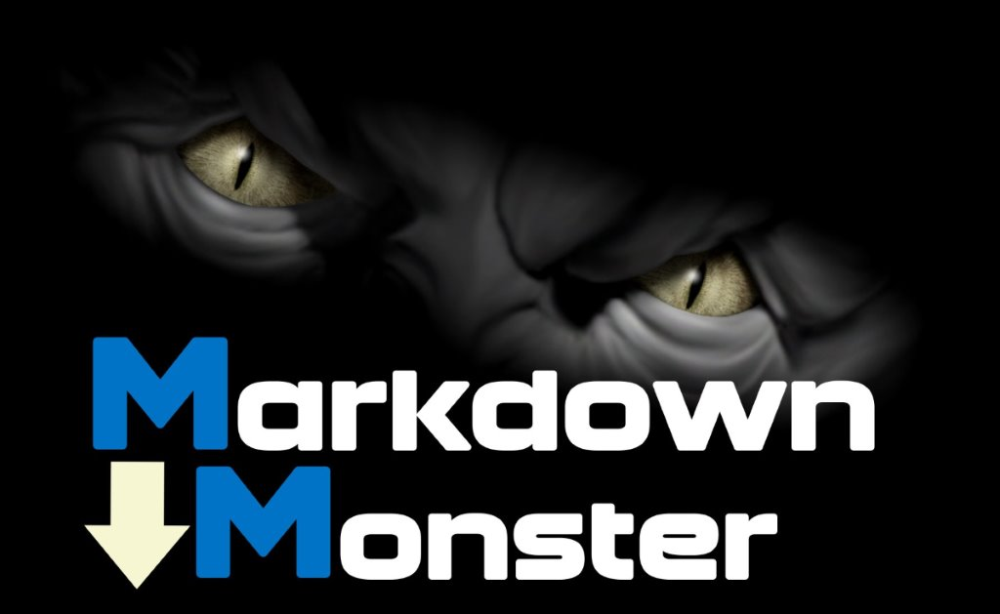
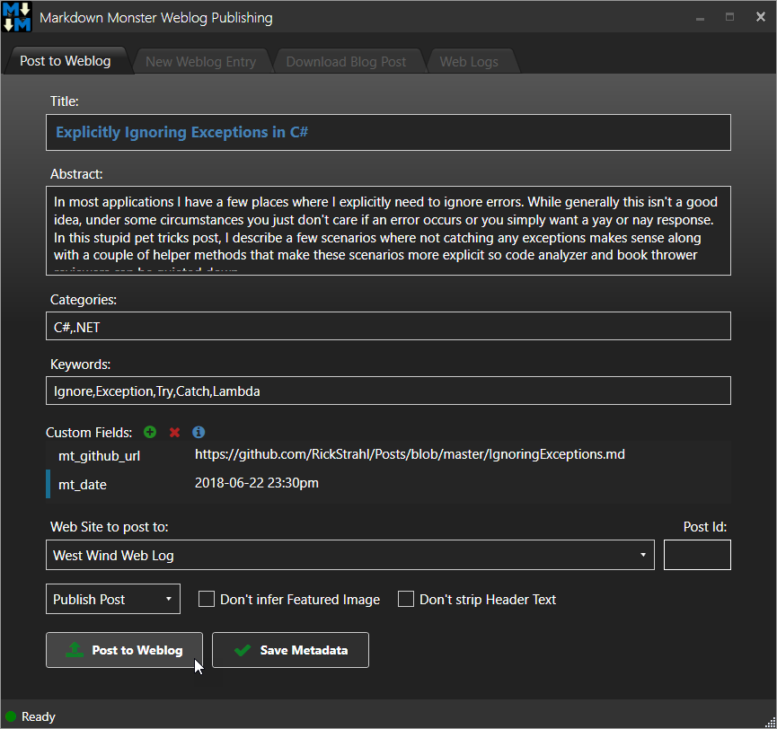
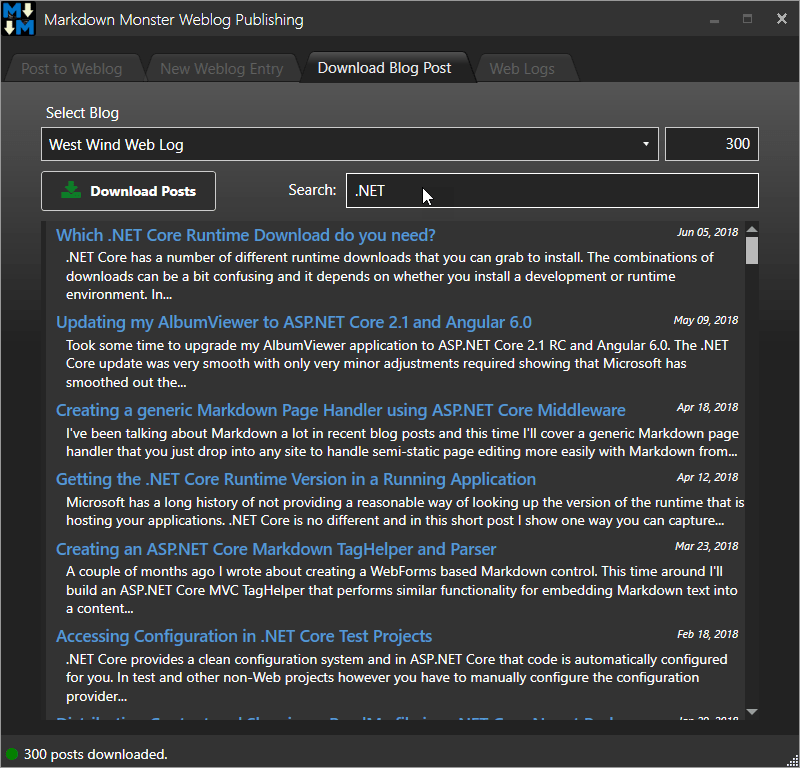
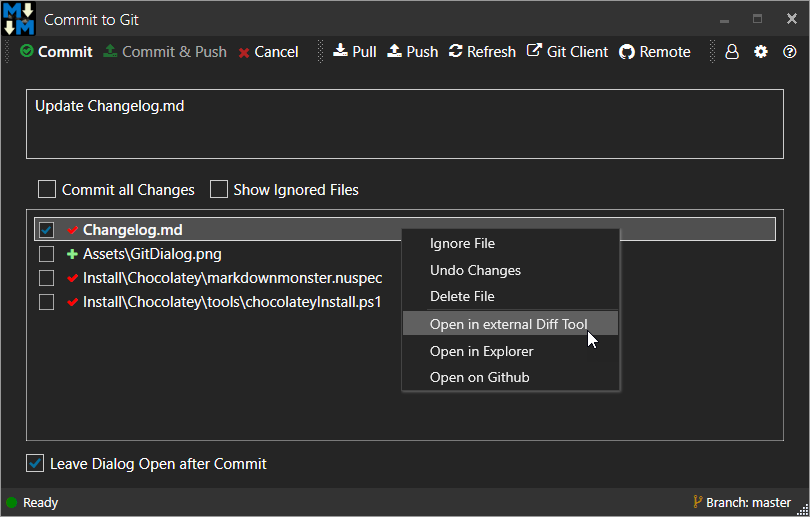
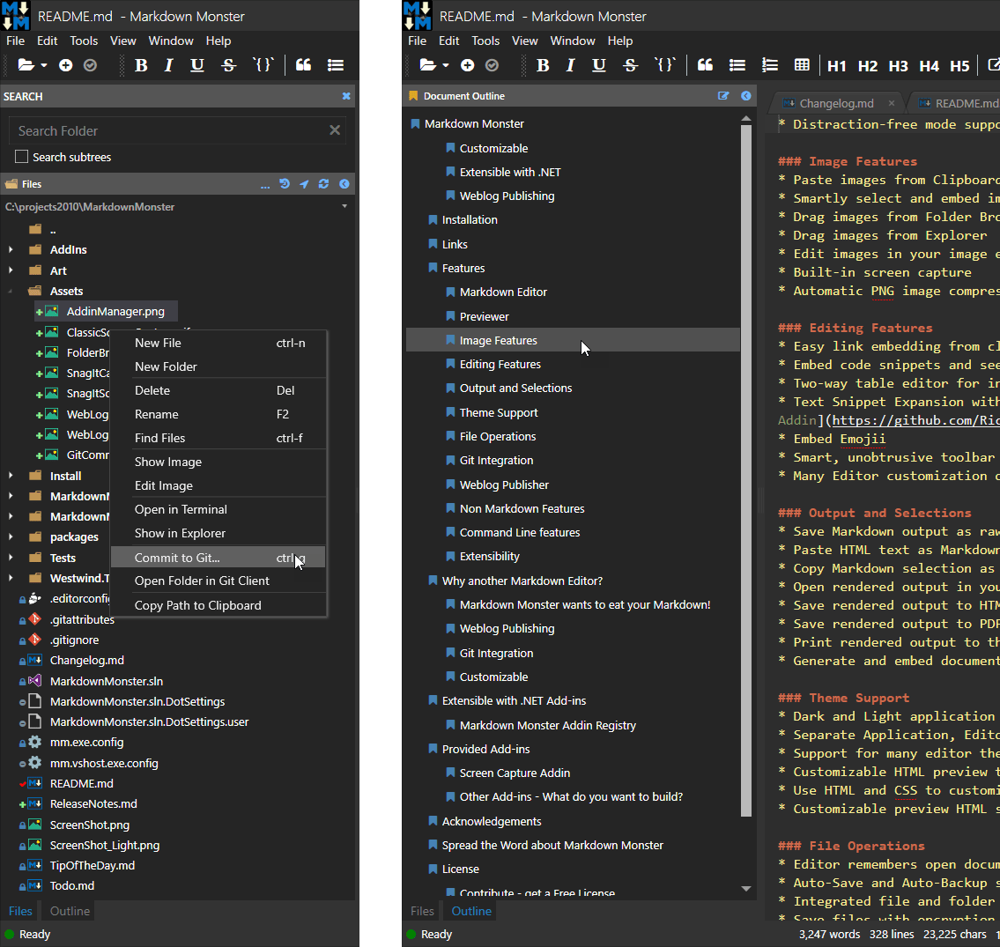
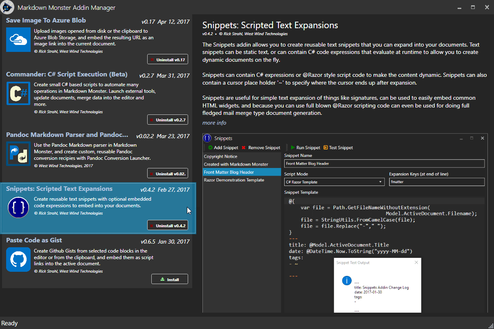
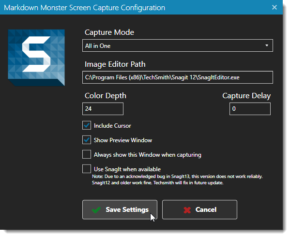
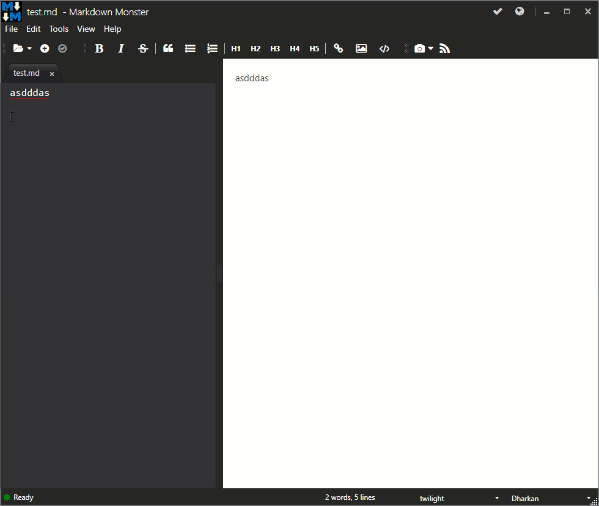
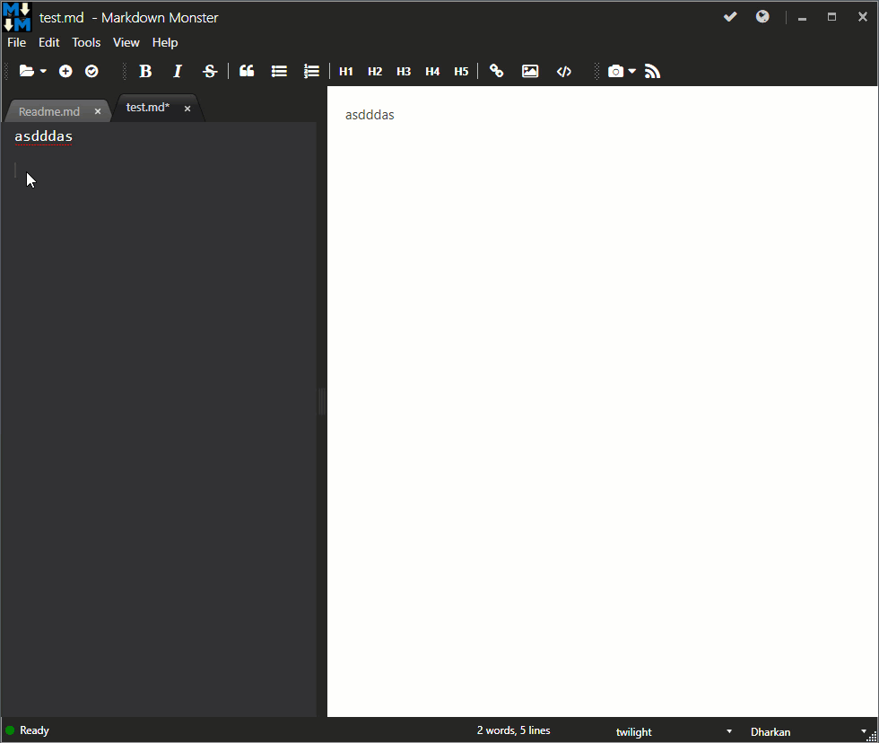

# Markdown Monster

[](https://markdownmonster.west-wind.com/download.aspx)
[](https://chocolatey.org/packages/MarkdownMonster)
[](https://chocolatey.org/packages/MarkdownMonster)
[](https://gitter.im/MarkdownMonster/MarkdownMonster)



Markdown Monster is an easy to use and extensible **Markdown Editor**, **Viewer** and **Weblog Publisher** for Windows. Our goal is to provide the best Markdown specific editor for Windows and make it as easy as possible to create Markdown documents. We provide a core editor and previewer, and a number of non-intrusive helpers to help embed content like images, links, tables, code and more into your documents with minimal effort.

Here's what Markdown Monster looks like using the default **Dark Theme**: 


and here is the **Light Theme**:


### Customizable
Markdown Monster is highly customizable with themes for the main shell, editor and preview displays. The editor and preview themes can be easily customized using HTML and CSS based templates. There are also many options to customize the editor's fonts, sizes and many display options.

You can also run in distraction free mode, that removes toolbars, menus, preview, sidebar and other distractions to let you focus on your code. Or use Presentation mode to view only the rendered Markdown.
 
### Extensible with .NET
One of the big features of Markdown Monster is that it's extensible with .NET code. You can use our Snippets or Commander addins to create custom text expansions, or automate common tasks using .NET Code snippets. A full addin extensibility model allows deep integration with most of Markdown Monster's features and UI to create sophisticated extensions using a straightforward Addin model. We use this extensibility model to extend base features of MM ourselves - the same is available to you. You can also share your addins in our addin registry.

### Weblog Publishing
Want to write your blog posts in Markdown? You can use Markdown Monster to write your posts in Markdown and publish the generated HTML content directly to your Wordpress, Medium, MetaWeblog or West Wind Post API Weblog engine in seconds. You can also use any Git based service for your posts by simply saving the post and its post meta data to disk. Basic Git integration is built-in to Markdown Monster to commit current documents or open your favority Git Client.

## Installation
You can download Markdown Monster and use the self-contained installer <small>(requires [Chocolatey](https://chocolatey.org/) is installed)</small>:

* **[Go to the Download Page](http://markdownmonster.west-wind.com/download.aspx)**


Or you can you use [Chocolatey](https://chocolatey.org/) to install from the Windows Comand Line:

```ps
c:\> choco install markdownmonster
```
To update to the latest version:
```ps
c:\> choco upgrade markdownmonster
```

## Links
* **[Markdown Monster Site](http://markdownmonster.west-wind.com)**
* **[What's New](Changelog.md)** (change log)
* **[Video: Getting Started with Markdown Monster](https://www.youtube.com/watch?v=XjFf57Ap9VE)**  
* **[Markdown Monster Addin Registry](https://github.com/RickStrahl/MarkdownMonsterAddinsRegistry)**  
* **[Create Addins with .NET](http://markdownmonster.west-wind.com/docs/_4ne0s0qoi.htm)**
* **[License](#license)**

* **[Bug Reports & Feature Requests](https://github.com/rickstrahl/MarkdownMonster/issues)**
* **[Discussion Forum](http://support.west-wind.com?forum=Markdown+Monster)**

* **[Follow @MarkdownMonstr on Twitter](https://twitter.com/markdownmonstr)**
* **[Documentation](https://markdownmonster.west-wind.com/docs/)**

> ### Show your Support
> If you like what you see here, please consider **starring this repo** (click the :star: in the top right corner of this page). If you have a favorite feature in Markdown Monster, it'd be awesome if you could tweet about it and mention [@markdownmonstr](https://twitter.com/markdownmonstr). Please help us spread the word. 


> ### Please report any Issues you run into!
> If you run into a problem with Markdown Monster, **please** let us know by [filing an issue](https://github.com/rickstrahl/MarkdownMonster/issues) or feature request here on GitHub. We want to know what doesn't work and get it fixed. **Help us make Markdown Monster better**!


## Features
Markdown Monster provides many useful features:

### Markdown Editor
* Syntax highlighted Markdown editing 
* Live and synced HTML preview 
* Gentle, optional toolbar support for Markdown newbies
* Inline spell checking
* Line and Word counts
* Synced Document Outline
* Distraction free mode

### Previewer
* Scroll synced preview window
* Optional external previewer for multi-screen
* External Browser preview
* Presentation mode support
* Distraction-free mode support

### Image Features
* Paste images from Clipboard
* Smartly select and embed images from disk or URL
* Drag images from Folder Browser
* Drag images from Explorer
* Edit images in your image editor of choice
* Built-in screen capture
* Automatic image compression on pasted images

### Editing Features
* Easy link embedding from clipboard or disk
* Embed code snippets and see highlighted syntax coloring
* Two-way table editor for interactively creating and editing tables
* Text Snippet Expansion with C# Code via [Snippets Addin](https://github.com/RickStrahl/Snippets-MarkdownMonster-Addin)
* Embed Emojii
* Smart, unobtrusive toolbar and shortcut key helpers
* Snippet expansion from text templates
* Many Editor customization options

### Output and Selections
* Save rendered output to raw or packaged HTML
* Save rendered output to PDF
* Copy Markdown selection as HTML
* Paste HTML text as Markdown
* Open rendered output in your favorite Web browser
* Print rendered output to the printer or PDF driver
* Generate and embed document Table of Contents

### Theme Support
* Dark and Light application themes
* Customizable Editor Themes
* Customizable Preview Themes
* Customizable output syntax coloring themes
* Use HTML and CSS to customize Preview and Editor Themes

### File Operations
* Editor remembers open documents by default (optional)
* Auto-Save and Auto-Backup support
* Integrated file and folder browser
* Many file common file operations on each file
    * Show in viewers
    * Edit in appropriate editors
    * Commit to Git
    * Compress images
* Save files with encryption
* Drag and drop documents from Explorer and Folder Browser
* Open a Terminal, Explorer or Git Client

### Git Integration
* Show Git Status in Folder Browser
* Commit and push Dialog
* Commit and push active file, folder browser file
* Commit and push all pending changes
* Compare changes in configured Git Diff client
* Undo Changes
* Add Ignored Files
* Clone Repository
* Open in Git Client

### Weblog Publishing
* Create or edit Weblog posts using Markdown
* Publish your Markdown directly to your blog
* Re-publish posts at any time
* Post data stored as YAML metadata in Markdown
* Send custom meta data with posts
* Supports MetaWebLog, Wordpress and Medium (limited)
* Supports document based blogs (Jekyll, Hugo, Wyam, Ghost etc.)
* Download and edit existing posts
* Very fast publish and download process
* Support for multiple blogs
* Dropbox and OneDrive shared post storage

### Non Markdown Features
* HTML file editing with live preview
* Many other file formats can also be edited:  
JSON, XML, CSS, JavaScript, Typescript, FoxPro, CSharp and more
* Optional shared configuration on Cloud drives
* High DPI Monitor Aware

### Command Line features
* Use `mm` or `markdown` to launch Markdown Monster
* Markdown Monster path added to user path
* `mm readme.md` - open single file
* `mm readme.md changelog.md` - open multiple files
* `mm .` - open folder browser in current folder
* `mm reset` - reset all Markdown Monster settings
* `mm uninstall` - remove all non-local system settings


### Extensibility
* Automate Markdown Monster with C# using the [Commander Addin](https://github.com/RickStrahl/Commander-MarkdownMonster-Addin)
* Create Addins with .NET code
* Visual Studio Project Template available
* Simple interface, easy to implement
* Access UI, menu and active documents
* Access document and application lifecycle events
* Add Custom Markdown Parsers
* Replace the Preview Rendering Engine
* Add Tabs to left and right sidebar panels
* Some published addins available:
    * [Console: A pinned Terminal Window](https://github.com/RickStrahl/Console-MarkdownMonster-Addin)
    * [Commander: C# based Script Automation](https://github.com/RickStrahl/Commander-MarkdownMonster-Addin)
    * [Gist: Open from and Save As Gists, and Paste Code as Gist](https://github.com/RickStrahl/PasteCodeAsGist-MarkdownMonster-Addin)
    * [Save Image to Azure Blob Storage](https://github.com/RickStrahl/SaveToAzureBlob-MarkdownMonster-Addin)


## Why another Markdown Editor?
Markdown is everywhere these days, and it's becoming a favorite format for many developers, writers and documentation experts to create lots of different kinds of content in this format. Markdown is used in a lot of different places:

* Source Code documentation files (like this one)
* Weblog posts
* Product documentation
* Message Board message entry
* Application text entry for formatted text

Personally I use Markdown for my Weblog, my message board, of course on GitHub and in a number of applications that have free form text fields that allow for formatted text - for example in our Webstore product descriptions are in Markdown. 

Having a dedicated Markdown Editor that gets out of your way, yet provides a few helpful features **and lets you add custom features** that make your content creation sessions more productive is important. [Check out this post](https://medium.com/markdown-monster-blog/why-use-a-dedicated-markdown-editor-1aff2aaad42) on why it makes sense to use a dedicated Markdown Editor rather than a generic text editor for Markdown document creation. The ability to easily publish your Markdown to any MetaWebLog or Wordpress API endpoint is also useful as it allows you to easily publish to blogs or any application that supports for either for these formats.

### Markdown Monster wants to eat your Markdown!
Markdown Monster is a Markdown editor and Viewer for Windows that lets you create edit or simply preview Markdown text. It provides basic editing functionality with a few nice usability features for quickly embedding images, links, code, tables, screen shots and other markup. You get a responsive text editor that's got you covered with Markdown syntax highlighting, a collapsible live preview, so you can see what your output looks like, inline spellchecking and a handful of optimized menu options that help you mark up your text and embed and link content into your Markdown document. Additionally utility features let you quickly jump to the command line or an Explorer window, commit a document to Git, or even edit images in your favorite image editor.

### Weblog Publishing
A common use case for Markdown is to create rich blog posts with embedded links and content and Markdown Monster makes it easy to pull together content from various sources. You can easily embed images either from the clipboard, or by linking images from URLs or files. You can also easily capture screen shots using the built in screen capture utility, or if you own [Techsmith's awesome SnagIt tool](https://www.techsmith.com/screen-capture.html) you can use our SnagIt integration directly from within the editor.

Writing long blog posts is one thing I do a lot of and this is one of the reasons I actually wanted an integrated solution in a Markdown editor. You can take any Markdown and turn it into a blog post by using the Weblog publishing feature. Click the Weblog button on the toolbar and set up your blog (MetaWebLog, WordPress or Medium), and then specify the Weblog specifics like title, abstract, tags and Web Site to publish to. You can also download existing blog posts from your blog and edit them as Markdown (with some conversion limitations) and then republish them.





Posting is very fast and you can easily re-post existing content when you need to make changes (not supported for Medium).

### Git Integration
These days working with Markdown often means working with Git repositories and Markdown Monster makes it easy to clone or create repositories, commit and push changes.



### Folder Browser and Document Outline Sidebars
There's also a folder browser which has built-in support for Git status so you can immediately see what documents have changed in your folder tree. The browser lets you navigate folders, create, delete and move files and there are many options to view and edit files. 

The document outline provides an overview of headings in your documents that you can easily jump to as you are working with your document.



### Customizable
Most editing and UI features in Markdown Monster are optional and can be turned on and off. Want to work distraction free and see no preview or spell checking hints? You can turn them off. Want to store configuration data in a shared cloud folder? You can do that too.

Want a different editor theme than the dark default or a preview theme that matches your blog or branding? You can easily switch to one of the many built-in editor themes. For previews you can use either one of several built-in themes or add your own with a simple, plain HTML/CSS template. You can even create themes that link to your own online styles.

The editor and previewer are HTML and JavaScript based, so you can also apply any custom styling and even hook up custom JavaScript code if you want to get fancy beyond the basic configuration. The preview themes are easy to modify as they are simply HTML and CSS templates.

## Extensible with .NET Add-ins
One of the **key feature** and the main reason I built Markdown Monster is that it is **extensible**, so that you and I can plug additional functionality into it without bloating the main product. 

You can find available public Addins you can install in the **Markdown Monster Addin Manager** from the **Tools** menu:  



There is a variety of functionality available in addins. Here are a few examples:

Right now the registry is pretty sparse, but here are a few Addins you can check out:

* [Console](https://github.com/RickStrahl/Console-MarkdownMonster-Addin)  
Lets you pin an always-active Terminal Console window to the bottom of Markdown Monster.

* [Commander C# Scripting](https://github.com/RickStrahl/Commander-MarkdownMonster-Addin)  
A C# based scripting addin that lets you automate tasks using script code. For simple tasks this is quicker and easier than creating a full addin.

* [Save Image to Azure Blob Storage](https://github.com/RickStrahl/SaveToAzureBlob-MarkdownMonster-Addin)  
Lets you save images as Azure Blob storage items and embeds a link to the an uploaded resoure into your Markdown.

* [Gist](https://github.com/RickStrahl/PasteCodeAsGist-MarkdownMonster-Addin)  
This addin allows you to **Open from Gist** and **Save as Gist** as well as letting you create code snippets and embed them as Gists into your Markdown content.

* [Pandoc Markdown Parser](https://github.com/RickStrahl/PasteCodeAsGist-MarkdownMonster-Addin)  
This addin provides a PanDoc Markdown processor that can be used instead of the default MarkDig parser. This addin also provides a host of document conversion options to convert your Markdown to PDF, DOC, EPub and a few other formats using an interactive dialog.

### .NET Based Extensibility
Markdown Monster Addins have access to an add-in model that lets you manipulate and automate any open documents and the editor, lets you load new documents, launch external processes, add menu options and other UI features, open a new sidebar, generally interact with the entire UI and attach to life cycle events to get notifications of various application events like documents opening and closing, documents being saved and the application shutting down, etc...

Complexity of Addins can vary greatly from very simple automation tools like the Console Addin that simply pins a Terminal window to Markdown Monster, or something as complex as the KavaDocs addin that manages an entire documentation application with many custom windows and sidebars that are integrated into Markdown Monster.

Addins have access to most features of Markdown Monster and they are fairly easy to create. We as well as several third parties have created a number of useful addins using the powerful addin model and I encourage you to browse addins to see what you can do.

### Creating Addins
One of the key features of Markdown Monster is that you can also create your own addins using the .NET based Markdown Monster Addin model. It's very easy to create new addins and we provide a [Visual Studio Project Template Extension](https://marketplace.visualstudio.com/items?itemname=rickstrahl.markdownmonsteraddinproject) to facilitate the process of getting started with creating an Addin. All of our plug-ins are also available on GitHub, so you can easily check out how other addins were created.

You can find documentation for creating Addins here:

* [Creating a Markdown Monster Addin](http://markdownmonster.west-wind.com/docs/_4ne0s0qoi.htm)
* [Markdown Monster Addin Visual Studio Project Template](https://marketplace.visualstudio.com/items?itemName=RickStrahl.MarkdownMonsterAddinProject)
* [Accessing and Manipulating the Active Editor](http://markdownmonster.west-wind.com/docs/_4nf02q0sz.htm)
* [Bringing up UI from your Addin](http://markdownmonster.west-wind.com/docs/_4ne1ch7wa.htm)


### Markdown Monster Addin Registry
You can create addins for your own use, simply by copying them into the `%appdata%\Addins` folder, or if you created an Addin that you think might be useful for others you can publish on the [Markdown Monster Addin Registry](https://github.com/RickStrahl/MarkdownMonsterAddinsRegistry). The registry holds public Addins that show in the Addin Manager inside of Markdown Monster:

You can find out more on how to publish your Addins in this GitHub repository:

* [Markdown Monster Addin Registry](https://github.com/RickStrahl/MarkdownMonsterAddinsRegistry)


## Provided Add-ins
Not only does Markdown Monster allow extension via Addins - it also uses Addins for some built-in features. Specifically the Screen Capture the Weblog Publishing modules are implemented as Add-ins and demonstrate the power of the Add-in model.

### Screen Capture Addin
The Screen Capture add-in supports two separate capture modes: Using Techsmith's popular and super versatile [SnagIt](http://techsmith.com/snagit) Screen Capture utility (which I **highly** recommend!) or using an integrated less featured Screen Capture module that allows capturing for Windows desktop windows and objects. To capture, simply click the capture button (camera icon) and the main app minimizes and either SnagIt or the integrate screen capture tool pops up to let you select the object to capture. You can preview and edit your captures, and when finished the captured image is linked directly into content.



Here's the **SnagIt Screen Capture** in action:



If you don't have SnagIt installed or you simply prefer a more light weight but less full featured solution, you can use the **built-in Screen Capture** that's a native part of Markdown Monster and doesn't require any external software:



### Other Add-ins - What do you want to build?
I can think of a few add-in ideas - a quick way to commit to Git and Push would be useful for documentation solutions, or Git based blogs, so you can easily persist changes to a GitHub repository. Embedding all sorts of content like reference links, AdSense links, Amazon product links, a new post template engine, etc., etc.

Or maybe you have custom applications that use Markdown text and provide an API that allows you to post the Markdown (or HTML) to the server. It's easy to build a custom add-in that lets you take either the Markdown text or rendered HTML and push it to a custom REST interface in your custom application.

## Acknowledgements
This application heavily leans several third party libraries without which this tool would not have been possible. Many thanks for the producers of these libraries:

* **[Ace Editor](https://ace.c9.io)**  
Ace Editor is a power HTML based editor platform that makes it easy to plug syntax highlighted software style editing possible in a browser. Markdown Monster uses Ace Editor for the main Markdown editing experience inside of a Web browser control that interacts with the WPF application.

* **[MarkDig Markdown Parser](https://github.com/lunet-io/markdig)**  
This extensible Markdown parser library is used for the rendering Markdown to HTML in Markdown Monster. The library is fast and supports a number of useful extensions like GitHub Flavored Markdown, table support, auto-linking and various add-on protocols. The feature set is extensible via a plug-in pipeline. 

* **[MahApps.Metro](http://mahapps.com/)**  
This library provides the Metro style window and theming support of the top level application shell. It's an easy to use library that makes it a snap to build nice looking WPF applications.

* **[Dragablz](https://dragablz.net/)**  
This library provides the tab control support for the editor allowing for nicely styled tab reordering and overflow. The library also supports tab tear off tabs and layout docking although this feature is not used in Markdown Monster.

* **[nHunspell Spell Checking](http://www.crawler-lib.net/nhunspell)**  
Spell checking is handled via the hunspell library and the .NET wrapper in nhunspell. This library checks for mispellings and provides lookups for misspelled words. Word parsing is done in JavaScript and the spell checking is done in .NET by piping word lists to .NET to check which is drastically faster than doing the spell checking in the browser using JavaScript.

## Spread the Word about Markdown Monster
If you like Markdown Monster please pass it on to help spread the word. Let your friends know, mention it to others who ask about Markdown and help us grow this community to encourage building the best Markdown Editor around.

Here are a few things you can do to help spread the word:

* **Follow us on Twitter**: [@MarkdownMonstr](https://twitter.com/markdownmonstr)
* **Tweet about Markdown Monster** and mention [@MarkdownMonstr](https://twitter.com/markdownmonstr)
* **Star this repo** by clicking on the Star icon in the header
* **Install from Chocolatey** with the [Markdown Monster Package](https://chocolatey.org/packages/MarkdownMonster)
* **Write an Addin**: [Create a Markdown Monster Addin](http://markdownmonster.west-wind.com/docs/_4ne0s0qoi.htm)
* **Write a blog post** and mention how you use Markdown Monster
* **Link to the [Markdown Monster Web Site](https://markdownmonster.west-wind.com)** to help us spread the Google Foo.

The support from the community so far with feedback, bug reports and ideas for new features has been awesome, and I look forward for that to continue with a growing community of active users and contributors.

## License
Although we provide the source in the open, Markdown Monster is licensed software &copy; West Wind Technologies, 2016-2017.

Markdown Monster can be downloaded and evaluated for free, but a [reasonably priced license](http://store.west-wind.com/product/MARKDOWN_MONSTER) must be purchased for continued use. Licenses are **per user**, rather than per machine, so an individual user can use Markdown Monster on as many computers they wish with their license. <a href="https://store.west-wind.com/product/markdown_monster_site">Organization licenses</a> are also available.

Thanks for playing fair.

### Contribute - get a Free License
Contributors that provide valuable feedback, help out with code/PRs, actively promote Markdown Monster or support Markdown Monster in any other significant way are eligible for a free license. Contact [Rick for more info](http://west-wind.com/contact/).

### Microsoft MVPs and Microsoft Employees get free Licenses
If you are a current Microsoft MVP or Insider, a Microsoft employee, or an employee of a company that offers free tools to Microsoft MVPs you qualify for a free license. Basically I want to give back to those that have given to the community and shared their knowledge or work. I'll consider anybody who has given back to the community for a free license. 

* [MVP License Request](https://store.west-wind.com/mvpperks.aspx)

## Warranty Disclaimer: No Warranty!
IN NO EVENT SHALL THE AUTHOR, OR ANY OTHER PARTY WHO MAY MODIFY AND/OR REDISTRIBUTE 
THIS PROGRAM AND DOCUMENTATION, BE LIABLE FOR ANY COMMERCIAL, SPECIAL, INCIDENTAL, OR CONSEQUENTIAL DAMAGES ARISING OUT OF THE USE OR INABILITY TO USE THE PROGRAM INCLUDING, BUT NOT LIMITED TO, LOSS OF DATA OR DATA BEING RENDERED INACCURATE OR LOSSES SUSTAINED BY YOU OR LOSSES SUSTAINED BY THIRD PARTIES OR A FAILURE OF THE PROGRAM TO OPERATE WITH ANY OTHER PROGRAMS, EVEN IF YOU OR OTHER PARTIES HAVE BEEN ADVISED OF THE POSSIBILITY OF SUCH DAMAGES.

---
&copy; Rick Strahl, West Wind Technologies, 2016-2018
