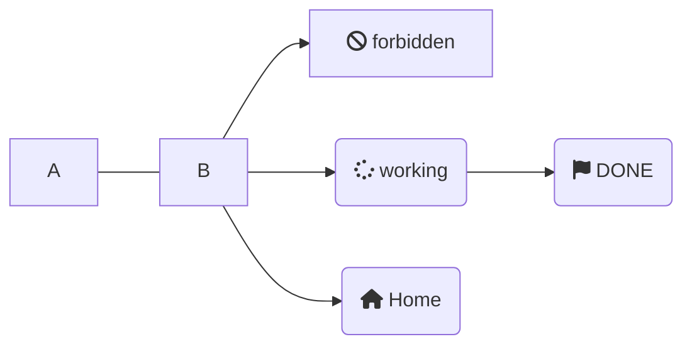
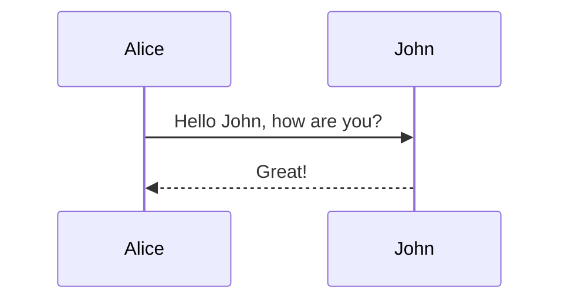
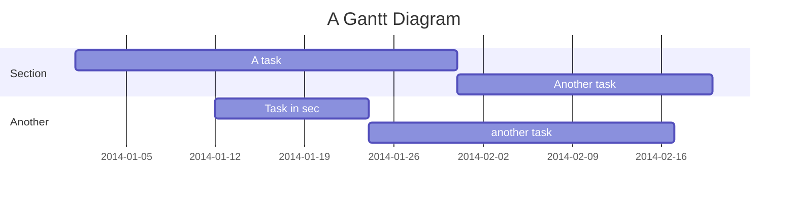

# Mermaid Diagrams

Mermaid is a JavaScript based parsing engine that allows you to embed blocks of graph markup into a page. Markdown Monster supports two different approaches using either code block or HTML tag syntax to embed the mermaid blocks.



### Sequence Diagram
You can use a `mermaid` code block:

~~~markdown
 ```mermaid
 sequenceDiagram
    Alice->>John: Hello John, how are you?
    John-->>Alice: Great!
 ```
~~~


to produce the following:




Alternately you can use `<div class="mermaid"></div>` to embed the code block logic:

```html
<div class="mermaid">
  graph LR
      A --- B
      B-->C[fa:fa-ban forbidden]
      B-->D(fa:fa-spinner );
</div>
```    

<div class="mermaid">
  graph LR
      A --- B
      B-->C[fa:fa-ban forbidden]
      B-->D(fa:fa-spinner);
</div>

### A Gannt Chart
Here's another example (use `Shift-F12` to preview):


````markdown
 ```mermaid
 gantt
    title A Gantt Diagram
    dateFormat  YYYY-MM-DD
    section Section
    A task           :a1, 2014-01-01, 30d
    Another task     :after a1  , 20d
    section Another
    Task in sec      :2014-01-12  , 12d
    another task      : 24d
 </div>
 ```
````


