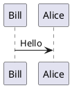
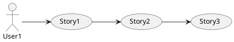

# Plant Uml Embedding

*Make sure you enable PlantUML in the options.*


 ```plantuml
@startuml
Bill -> Alice : Hello
@enduml
```

* [Documentation](https://markdownmonster.west-wind.com/docs/_6x60qvpvi.htm)
* [Plant UML Examples](https://real-world-plantuml.com/)


### Simple Sequence Diagram



### Use Case Diagram



### Sequence Diagram


@startuml
skinparam monochrome true
participant Participant as Foo
actor       Actor       as Foo1
boundary    Boundary    as Foo2
control     Control     as Foo3
entity      Entity      as Foo4
database    Database    as Foo5
collections Collections as Foo6
queue       Queue       as Foo7
Foo -> Foo1 : To actor 
Foo -> Foo2 : To boundary
Foo -> Foo3 : To control
Foo -> Foo4 : To entity
Foo -> Foo5 : To database
Foo -> Foo6 : To collections
Foo -> Foo7: To queue
@enduml
